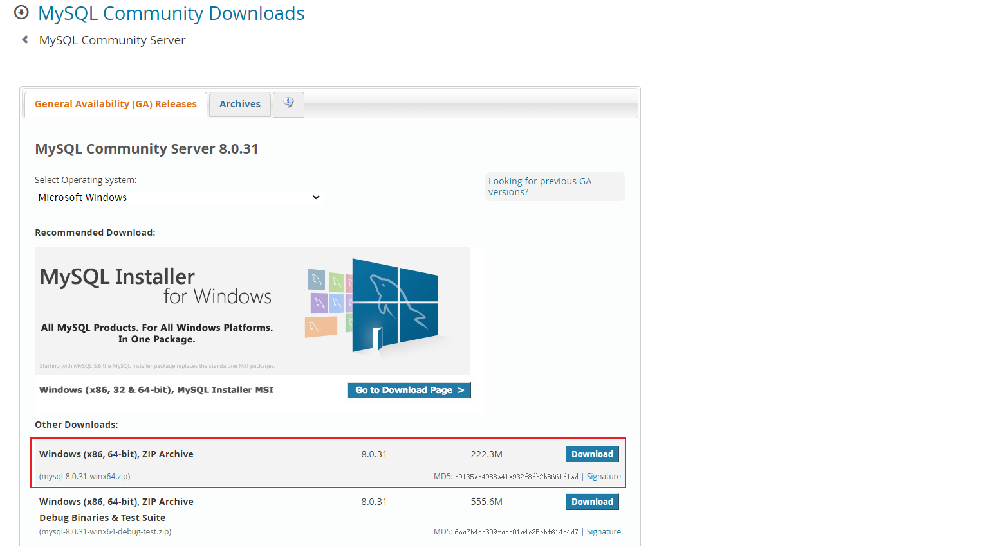
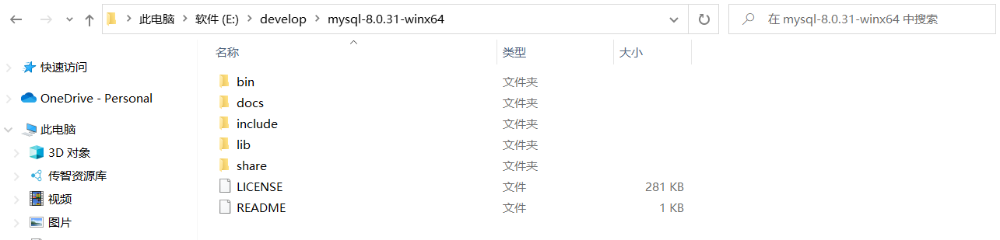
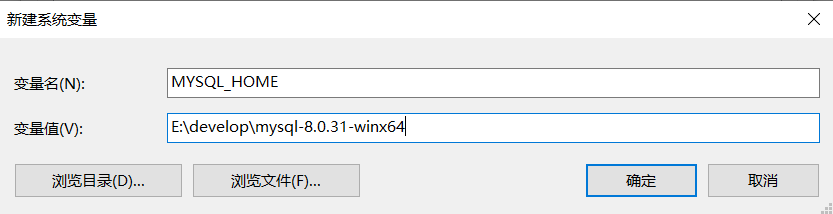
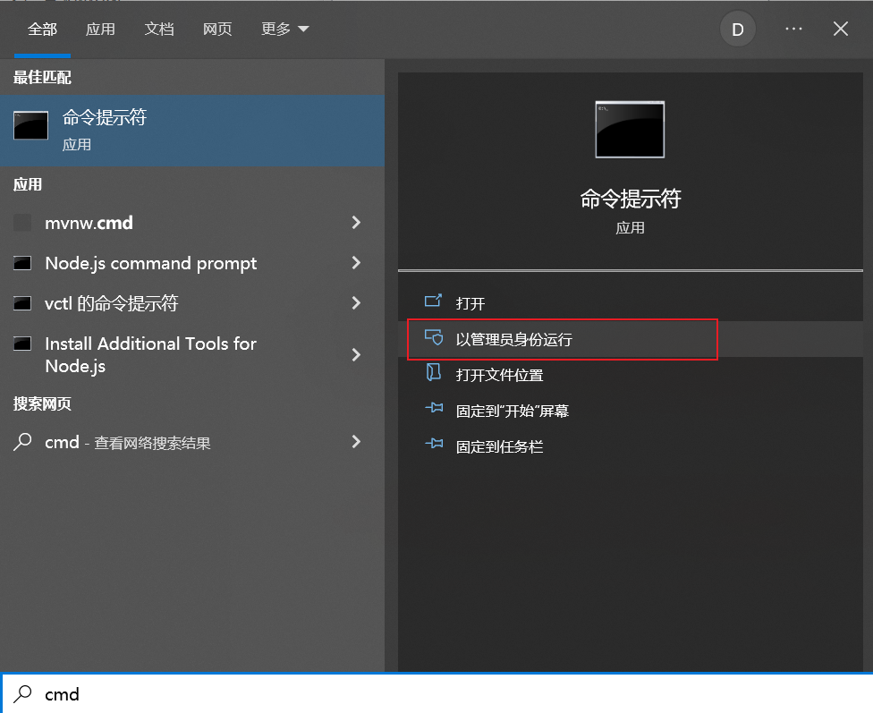
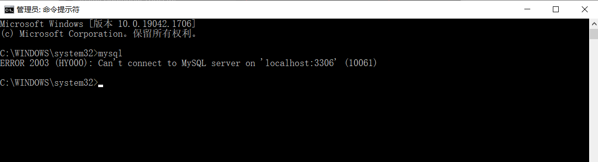
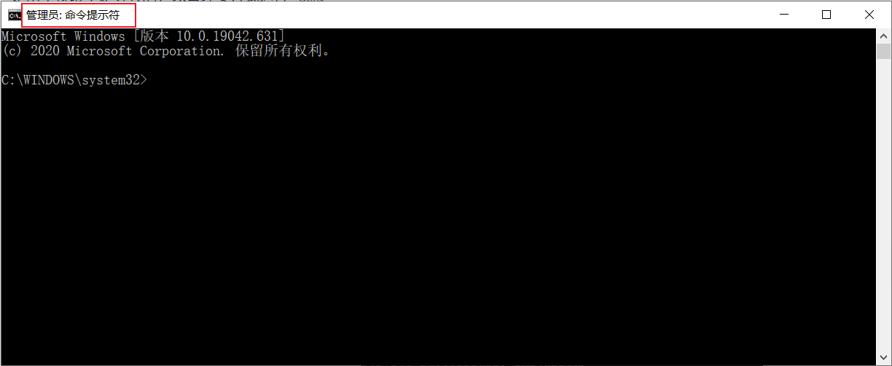
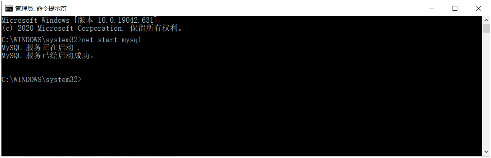
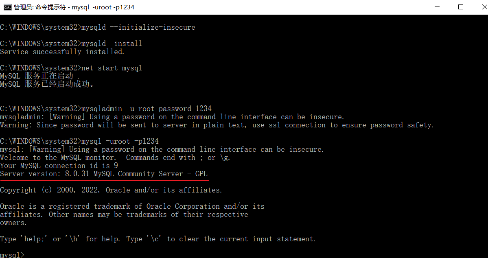
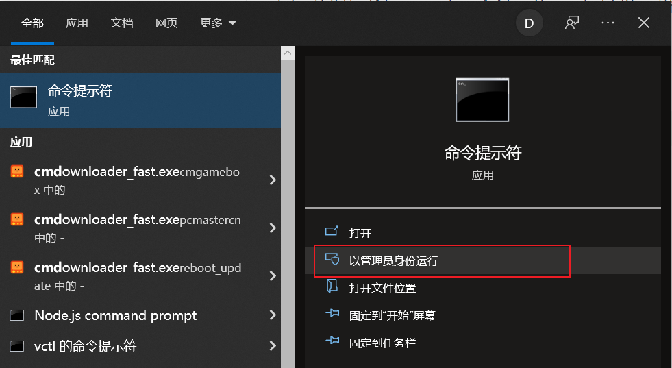

## 一、下载

点开下面的链接：https://dev.mysql.com/downloads/mysql/

 

点击Download 就可以下载对应的安装包了, 安装包如下:   


## 二、解压

下载完成后我们得到的是一个压缩包，将其解压，我们就可以得到MySQL 8.0.31 的软件本体了(就是一个文件夹)，我们可以把它放在你想安装的位置 。

 


## 三、配置

### 1. 添加环境变量

> 环境变量里面有很多选项，这里我们只用到`Path`这个参数。为什么在初始化的开始要添加环境变量呢？
>
> 在黑框(即CMD)中输入一个可执行程序的名字，Windows会先在环境变量中的`Path`所指的路径中寻找一遍，如果找到了就直接执行，没找到就在当前工作目录找，如果还没找到，就报错。我们添加环境变量的目的就是能够在任意一个黑框直接调用MySQL中的相关程序而不用总是修改工作目录，大大简化了操作。


右键`此电脑`→`属性`，点击`高级系统设置`

 


点击`环境变量`

 


在`系统变量`中新建MYSQL_HOME

  


在`系统变量`中找到并**双击**`Path`

 


点击`新建`

 

最后点击确定。


**如何验证是否添加成功？**

右键开始菜单(就是屏幕左下角)，选择`命令提示符(管理员)`，打开黑框，敲入`mysql`，回车。

 


如果提示`Can't connect to MySQL server on 'localhost'`则证明添加成功；

  


如果提示`mysql不是内部或外部命令，也不是可运行的程序或批处理文件`则表示添加添加失败，请重新检查步骤并重试。


### 2. 初始化MySQL

==以管理员身份，运行命令行窗口：==




在刚才的命令行中，输入如下的指令： 

```
mysqld --initialize-insecure
```

 

稍微等待一会，如果出现没有出现报错信息，则证明data目录初始化没有问题，此时再查看MySQL目录下已经有data目录生成。


tips：如果出现如下错误

 

是由于权限不足导致的，以管理员方式运行 cmd

 


### 3. 注册MySQL服务

命令行（注意必须以管理员身份启动）中，输入如下的指令，回车执行： 

```
mysqld -install
```


 

现在你的计算机上已经安装好了MySQL服务了。


### 4. 启动MySQL服务

在黑框里敲入`net start mysql`，回车。

```java
net start mysql  // 启动mysql服务
    
net stop mysql  // 停止mysql服务
```

 


### 5. 修改默认账户密码

在黑框里敲入`mysqladmin -u root password 1234`，这里的`1234`就是指默认管理员(即root账户)的密码，可以自行修改成你喜欢的。

```
mysqladmin -u root password 1234
```

 


## 四、登录MySQL

右键开始菜单，选择`命令提示符`，打开黑框。
在黑框中输入，`mysql -uroot -p1234`，回车，出现下图且左下角为`mysql>`，则登录成功。

```
mysql -uroot -p1234
```

  


 

**到这里你就可以开始你的MySQL之旅了！**

退出mysql：

```
exit
quit
```


登陆参数：

```
mysql -u用户名 -p密码 -h要连接的mysql服务器的ip地址(默认127.0.0.1) -P端口号(默认3306)
```


## 五、卸载MySQL

如果你想卸载MySQL，也很简单。

点击开始菜单，输入cmd，选择 "命令提示符"，选择右侧的 "以管理员身份运行"。

 


1. 敲入`net stop mysql`，回车。

```
net stop mysql
```

 


2. 再敲入`mysqld -remove mysql`，回车。

```
mysqld -remove mysql
```

 


3. 最后删除MySQL目录及相关的环境变量。

**至此，MySQL卸载完成！**


