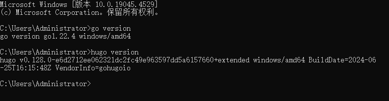

# hugo-win10环境的搭建

## 一、前言

当前市面上的个人博客搭建项目有很多，如wordpress, halo, hexo, hugo等。以下简单聊一聊这几种方案：

`动态博客`

- wordpress由php语言开发，使用了mysql作为数据库，属于动态博客，即根据数据库内容动态渲染网页。其官网上提供了许多收费（主）或免费的主题和模板，自带用户界面以及管理后台，上面还提供了丰富的插件扩展，用户可以根据个人喜好进行配置。可见wordpress是一个易用的、动态的、灵活的博客选型方案。但是需要注意的是wordpress加载速度会随插件主题的复杂程增加而变慢，例如市面上用户大量投诉字体加载慢的问题。
- halo是一个开源的博客，有java语言开发，使用了springboot框架。也有官方社区论坛，上面提供了一些收费的或免费的主题和模板。支持markdown格式、评论模块、网站统计等丰富的功能。当前这个开源项目还在不断更新当中，学习过java SSM的朋友可以考虑在这个项目的基础上个人再开发定制自己喜欢的内容。需要注意的是，halo使用了java springboot，对服务器内存的需求较大。

`静态博客`

- hexo是一个基于node.js的静态开源博客框架，支持使用markdown来解析文章。网上可以找到其官网，上面提供了丰富的主题和插件，个人比较推荐butterfly主题。静态的博客的优点与缺点都集中在静态二字，静态意味着网页是预先就编译好的，直接加载已经编译的内容就行，而且无需额外安装数据库也能搭建博客，所以这种方案对服务器的要求很小，搭建环境也比较简单。但是需要注意到静态网页的每个改动都需要重新编译网页。由于博客是静态的，还是用的node.js，特别推荐给学过前端的朋友，博客的外观和风格可以高度个性化！
- hugoHugo是一个由Go语言编写的静态网站生成器，它的主要功能是将Markdown或其他格式的内容转换为静态的HTML、CSS和JavaScript文件。这些文件可以直接部署到Web服务器上，从而快速、高效地展示内容。需要注意的是Hugo主要关注于生成静态网站，因此它不支持原生注册登录、原生评论等动态功能。这些功能通常需要依赖第三方服务或插件来实现，对个人动手能力有一定的要求。

`关于我为什么选择hugo`

>1. 我个人是使用java的，深知 java 虚拟机占用的内存相当可观。个人博客主要是为了记录与分享一些个人学习的内容，没有打算在服务器上花多少钱。也许以后会该也说不定~先这样用着好吧
>2. 静态博客的内容保存在本地，方便后期迁移。不怕丢失。可以直接推送到git或者gitee上。
>3. 被一款叫stack的主题吸引，淡雅的风格。(全在我的审美点上，简直是梦中情博！！！


## 二、在windows10上搭建hugo环境

### 1. 下载安装git、go并安装

[go下载链接](https://golang.google.cn/dl/ ])

[git下载链接](https://git-scm.com/download/win)

> 注意事项！！！！
>
> 1. 推荐配置环境变量，把 上述文件的.exe文件与bin文件夹添加到系统环境变量当中
> 2. git的网页有些玄学，有时候会被墙。打不开就百度上找，随便装一个，安装最新版就行！


### 2.下载hugo解压

[hugo下载链接](https://github.com/gohugoio/hugo/releases)

选择系统对应的版本号进行下载，这里我需选择 xxx_windowns-amd64.zip

- 我实际装的是hugo_extended_0.128.0_windows-amd64.zip，[下载链接](https://github.com/gohugoio/hugo/releases/download/v0.128.0/hugo_extended_0.128.0_windows-amd64.zip)

  

> 注意事项！！！！
>
> 1. hugo分extend与普通版。extend只是比普通版多了一些可以自己操作的东西。具体区别可以参考[官方文档](https://gohugo.io/installation/windows/)

懒人可以直接看以下内容，我把主要的内容剪切过来了：

> ## Editions
>
> Hugo is available in two editions: standard and extended. With the extended edition you can:
>
> - Encode to the WebP format when [processing images](https://gohugo.io/content-management/image-processing/). You can decode WebP images with either edition.
> - [Transpile Sass to CSS](https://gohugo.io/hugo-pipes/transpile-sass-to-css/) using the embedded LibSass transpiler. The extended edition is not required to use the [Dart Sass](https://gohugo.io/hugo-pipes/transpile-sass-to-css/#dart-sass) transpiler.
>
> We recommend that you install the extended edition.
>
> ### 版本
>
> ---
>
> Hugo有两个版本：标准版和扩展版。使用扩展版，您可以：
>
> - 处理图像时编码为WebP格式。您可以使用任一版本解码WebP图像。
> - 使用嵌入式LibSass Transpile将Sass转换为CSS。扩展版不需要使用Dart Sass transpiler。
>   我们建议您安装扩展版。


### 3.安装验证

任意位置打开cmd终端输入：

```
# 验证go
go version
# 验证hugo
hugo version
```

安装成功的效果：



`可能存在的问题：`

1. go或hugo不是命令。答：没有配置环境变量。打开系统高级设置->环境变量，点击用户变量中的Path，点击编辑，点击右上角新建，输入上面go\hugo安装后的bin文件夹，或者.exe的地址，点击确定。
2. github类的下载链接无法打开。答：这些链接能不能打开确实是个玄学。建议隔一段时间试试、或者用手机热点、或者使用魔法梯子。

## 四、总结

如果上述步骤都没有问题，恭喜你！！！hugo环境已经搭建好了！下一篇笔记我将讲解网页搭建过程。